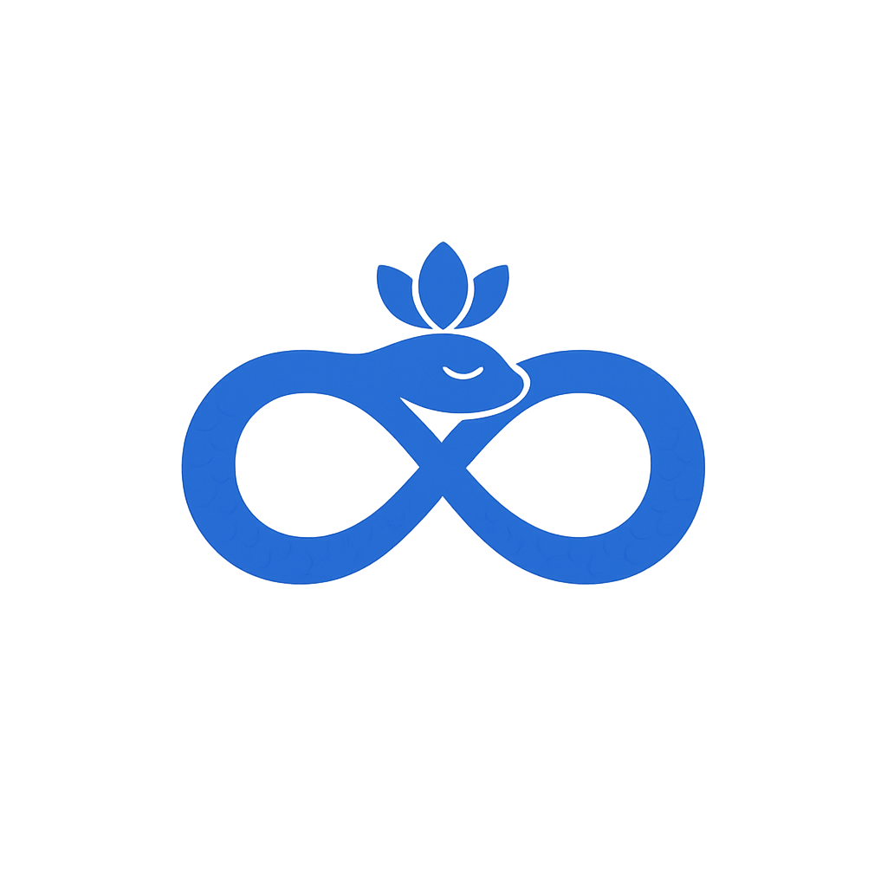

<p align="center">
  
</p>

<h1 align="center">Ouroboros</h1>

<p align="center">
  An MCP server for the Instagram Graph API.<br/>
  Publish, message, monitor — across multiple accounts.<br/>
  <strong>The endless loop, on your terms.</strong>
</p>

<p align="center">
  <a href="https://buymeacoffee.com/hello_emrah"></a>
</p>

---

The serpent eats her tail. The platform's content cycle is endless and so is the rhythm of working it: post, reply, monitor, post again. Ouroboros wraps Meta's Graph API so the cycle runs through Claude Code instead of a browser tab and a phone. The lotus crown on the mark is the reminder: you sit above the loop, not inside it.

## Features

- Publish single photos and carousels
- Read and send DMs
- Read and reply to comments
- Fetch account info and recent posts
- Multi-account support, configure any number of accounts via env vars, no code changes

## Requirements

- Node.js 18+
- Instagram Business or Creator account
- Meta Developer App with Instagram Graph API enabled

## Installation

```bash
git clone https://github.com/hello-emrah/ouroboros-mcp.git
cd ouroboros-mcp
npm install
```

## Configuration

Copy `.env.example` to `.env` and fill in your credentials.

```bash
cp .env.example .env
```

```env
# Comma-separated list of account keys (name them whatever you like)
INSTAGRAM_ACCOUNTS=myaccount,mybusiness

# Repeat for each account key
INSTAGRAM_MYACCOUNT_TOKEN=your_long_lived_access_token
INSTAGRAM_MYACCOUNT_USER_ID=your_instagram_user_id

INSTAGRAM_MYBUSINESS_TOKEN=your_long_lived_access_token
INSTAGRAM_MYBUSINESS_USER_ID=your_instagram_user_id

META_APP_ID=your_app_id
META_APP_SECRET=your_app_secret
```

### Getting your credentials

1. Go to [developers.facebook.com/apps](https://developers.facebook.com/apps/) and create a **Business** app
2. Add the **Instagram Graph API** product to your app
3. Under Settings → Basic, copy your App ID and App Secret
4. Add these permissions under App Review → Permissions:
   - `instagram_business_basic`
   - `instagram_content_publish`
   - `instagram_manage_comments`
   - `instagram_manage_messages` *(requires Meta app review for production; works in dev mode for your own accounts)*
5. Use the [Graph API Explorer](https://developers.facebook.com/tools/explorer) to generate a User Token, then exchange it for a long-lived token (60 days)
6. Call `GET /me?fields=id,username` to get each account's User ID

## Wiring into Claude Code

Add to your `~/.claude.json` under `mcpServers`:

```json
"ouroboros": {
  "command": "node",
  "args": ["/path/to/ouroboros-mcp/index.js"],
  "env": {
    "INSTAGRAM_ACCOUNTS": "myaccount,mybusiness",
    "INSTAGRAM_MYACCOUNT_TOKEN": "...",
    "INSTAGRAM_MYACCOUNT_USER_ID": "...",
    "INSTAGRAM_MYBUSINESS_TOKEN": "...",
    "INSTAGRAM_MYBUSINESS_USER_ID": "...",
    "META_APP_ID": "...",
    "META_APP_SECRET": "..."
  }
}
```

Restart Claude Code. Tools appear under the `mcp__ouroboros__*` namespace.

## Tools

| Tool | Description |
|---|---|
| `get_account_info` | Profile info, follower count, bio |
| `get_recent_posts` | Recent media with likes and comments count |
| `publish_photo` | Publish a single image post |
| `publish_carousel` | Publish a multi-image carousel (2 to 10 images) |
| `get_conversations` | List DM conversations |
| `get_messages` | Messages within a conversation |
| `send_message` | Send a DM to a user |
| `get_post_comments` | Comments on a post, including replies |
| `reply_to_comment` | Reply to a specific comment |

All tools take an `account` parameter matching one of your configured account keys.

## Notes

- Images must be publicly accessible URLs for publishing
- DM sending requires `instagram_manage_messages`, works in dev mode for accounts added as app testers, requires Meta app review for general use
- Long-lived tokens expire after 60 days and need to be refreshed

## Design philosophy

The visual mark and the tool itself were built deliberately against the visual language of capitalist software design. Single-shade flat seals in considered colours, ancient-glyph silhouettes, generous whitespace. The mark could be pressed into wax or carved into stone. The Meta-blue here is intentional, a wink: an ouroboros-shaped tool wrapping Meta's own infinity-looped API.

Built for personal use and shared openly. Not productised, not monetised, not instrumented. Use it for your own work or fork it for yours.

## License

MIT
